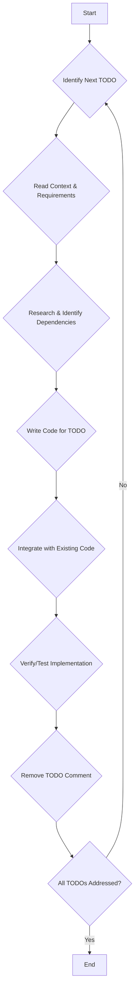

## Plan to Address TODOs in the Codebase

### 1. Overview

This plan outlines a systematic approach for an LLM to implement the identified "TODO" items within the `triaj-research` codebase. The primary focus is on enhancing the `federated_learning.py` and `explainable_ai.py` modules by implementing advanced techniques for domain adaptation, data drift detection, privacy, robust aggregation, communication efficiency, fairness, feature importance, and LLM integration.

### 2. Scope

**Included:**
*   Implementation of all "TODO" items found in `federated_learning.py`.
*   Implementation of all "TODO" items found in `explainable_ai.py`.
*   Integration of necessary libraries and frameworks (e.g., `alibi-detect`, `shap`, `Opacus`, `TensorFlow Privacy`, OpenAI API).
*   Adding basic unit tests or verification steps where applicable to confirm functionality.

**Excluded:**
*   "TODO" items in `.git/hooks/sendemail-validate.sample` as these are sample git configuration files and not part of the core application logic.
*   Extensive refactoring or architectural changes beyond the scope of implementing the specified TODOs.
*   Deployment or production-level considerations.

### 3. General Approach for LLM Implementation

For each "TODO" item, the LLM should follow these steps:

1.  **Understand Context**: Read the surrounding code and comments to fully grasp the intent and requirements of the TODO.
2.  **Research (if necessary)**: If the TODO involves a specific algorithm or library (e.g., DANN, ADWIN, Opacus), research its usage, common implementations, and best practices. This may involve searching documentation or examples.
3.  **Identify Dependencies**: Determine if new libraries need to be installed or imported.
4.  **Write Code**: Implement the functionality as described in the TODO comment.
5.  **Integrate**: Ensure the new code integrates seamlessly with existing methods and classes.
6.  **Test/Verify**: Add simple print statements, assertions, or mock tests to verify the implemented functionality.
7.  **Remove TODO Comment**: Once implemented and verified, remove the `TODO` comment.

### 4. Detailed Breakdown by File/Feature

#### A. `federated_learning.py`

This file contains TODOs related to various aspects of Federated Learning. Each method within the `FederatedLearningManager` class needs specific implementations.

*   **Domain Adaptation:**
    *   **TODO: Implement DANN** [`federated_learning.py:149`](federated_learning.py:149)
        *   **Action**: Integrate a Domain-Adversarial Neural Network (DANN) approach. This typically involves adding a gradient reversal layer and a domain classifier.
        *   **Libraries**: Potentially `PyTorch` or `TensorFlow` for custom layers, or existing implementations if available.
    *   **TODO: Implement MMD-based adaptation** [`federated_learning.py:154`](federated_learning.py:154)
        *   **Action**: Implement Maximum Mean Discrepancy (MMD) loss to align feature distributions between domains.
        *   **Libraries**: `torchmetrics` or custom MMD loss calculation.

*   **Data Drift Detection:**
    *   **TODO: Implement ADWIN for continuous drift detection** [`federated_learning.py:175`](federated_learning.py:175)
        *   **Action**: Integrate the ADWIN algorithm for real-time data drift detection.
        *   **Libraries**: `alibi-detect`.
    *   **TODO: Implement Kolmogorov-Smirnov Test for drift detection** [`federated_learning.py:181`](federated_learning.py:181)
        *   **Action**: Apply the KS-Test to compare feature distributions between current and baseline data.
        *   **Libraries**: `scipy.stats`.

*   **Differential Privacy:**
    *   **TODO: Integrate Opacus (for PyTorch) or TensorFlow Privacy** [`federated_learning.py:205`](federated_learning.py:205)
        *   **Action**: Apply differential privacy by adding calibrated noise to gradients during training. Choose the appropriate library based on the existing ML framework (e.g., `Opacus` for PyTorch, `TensorFlow Privacy` for TensorFlow).
        *   **Libraries**: `opacus` or `tensorflow_privacy`.

*   **Robust Aggregation:**
    *   **TODO: Implement Krum aggregation** [`federated_learning.py:245`](federated_learning.py:245)
        *   **Action**: Implement the Krum algorithm to select robust client updates by identifying and discarding malicious ones.
        *   **Logic**: Calculate Euclidean distances between updates, sum distances to k-1 nearest neighbors, select updates with smallest sums.
    *   **TODO: Implement Trimmed Mean aggregation** [`federated_learning.py:252`](federated_learning.py:252)
        *   **Action**: Implement trimmed mean aggregation, which involves sorting parameter values and discarding a percentage from both ends before averaging.
    *   **TODO: Implement Median aggregation** [`federated_learning.py:259`](federated_learning.py:259)
        *   **Action**: Implement median aggregation, taking the median of each parameter across all client updates.

*   **Communication Efficiency:**
    *   **TODO: Implement Top-k sparsification** [`federated_learning.py:281`](federated_learning.py:281)
        *   **Action**: Implement a mechanism to select only the top-k largest values (by magnitude) from client updates to reduce communication overhead.
    *   **TODO: Implement quantization (e.g., 1-bit, 2-bit)** [`federated_learning.py:287`](federated_learning.py:287)
        *   **Action**: Implement a quantization scheme to reduce the precision of model updates before transmission.

*   **Federated Fairness:**
    *   **TODO: Implement actual fairness calculation for different subgroups** [`federated_learning.py:314`](federated_learning.py:314)
        *   **Action**: Evaluate model performance metrics (e.g., accuracy, F1-score, false positive rate) for predefined demographic or sensitive subgroups.
        *   **Libraries**: `aif360` or custom implementation using `scikit-learn` metrics.

#### B. `explainable_ai.py`

This file contains TODOs related to generating explanations for AI models.

*   **Feature Importance:**
    *   **TODO: Implement SHAP value calculation** [`explainable_ai.py:24`](explainable_ai.py:24)
        *   **Action**: Use the `shap` library to calculate SHAP values for a given data point and model.
        *   **Libraries**: `shap`.
    *   **TODO: Implement Permutation Importance** [`explainable_learning.py:30`](explainable_ai.py:30)
        *   **Action**: Implement permutation importance by shuffling individual features and measuring the impact on model performance.
        *   **Libraries**: `eli5` or custom implementation using `scikit-learn`.

*   **LLM Explanation:**
    *   **TODO: Integrate with OpenAI GPT-4o API** [`explainable_ai.py:73`](explainable_ai.py:73)
        *   **Action**: Make API calls to OpenAI's GPT-4o model to generate natural language explanations based on model predictions, top features, and patient context.
        *   **Libraries**: `openai` Python client.

### 5. Workflow Diagram

### 6. Success Criteria

A "TODO" item is considered successfully implemented when:
*   The described functionality is fully coded.
*   The code integrates correctly without breaking existing functionality.
*   Basic verification (e.g., print statements, simple tests) confirms the new feature works as expected.
*   The `TODO` comment is removed from the code.