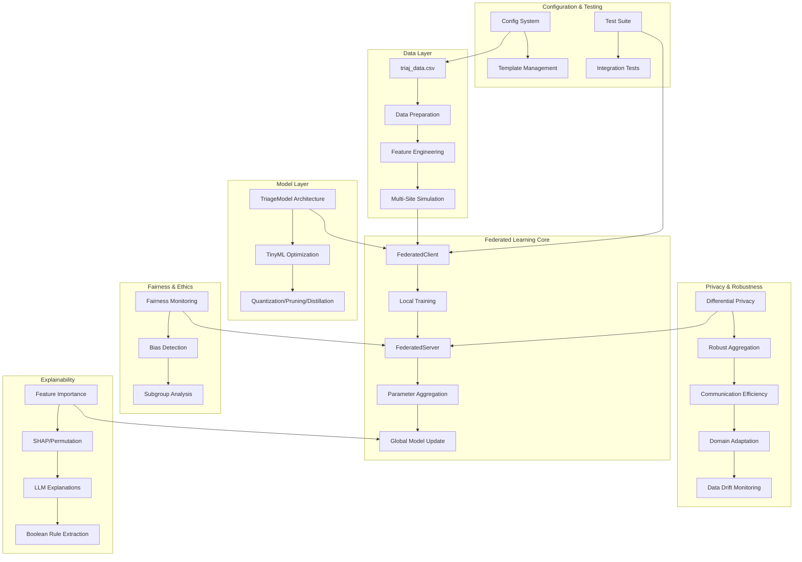

# FairTriEdge-FL: Comprehensive Codebase Analysis

## Executive Summary

FairTriEdge-FL is a sophisticated federated learning system designed for medical triage applications. The codebase implements a comprehensive framework that combines privacy-preserving machine learning, fairness monitoring, explainable AI, and edge computing optimization for healthcare environments. This analysis provides a complete overview of the system architecture, implementation status, technical components, and research methodology.

## Table of Contents

1. [System Architecture Overview](#system-architecture-overview)
2. [Implementation Status](#implementation-status)
3. [Technical Component Analysis](#technical-component-analysis)
4. [Research Methodology & Medical Context](#research-methodology--medical-context)
5. [Configuration & Deployment](#configuration--deployment)
6. [Strengths & Limitations](#strengths--limitations)
7. [Future Development Roadmap](#future-development-roadmap)

## System Architecture Overview

### High-Level Architecture



### Core Components

The system is organized into several key modules:

- **[`src/main.py`](../src/main.py)**: Main orchestration script implementing the 5-phase research pipeline
- **[`src/federated_learning.py`](../src/federated_learning.py)**: Core federated learning implementation with client-server architecture
- **[`src/explainable_ai.py`](../src/explainable_ai.py)**: Advanced explainability features with LLM integration
- **[`src/model_architecture.py`](../src/model_architecture.py)**: Multimodal neural network for triage classification
- **[`src/data_preparation.py`](../src/data_preparation.py)**: Data loading and preprocessing pipeline
- **[`src/feature_engineering.py`](../src/feature_engineering.py)**: Medical feature extraction and encoding
- **[`config/`](../config/)**: Comprehensive configuration management system
- **[`tests/`](../tests/)**: Extensive test suite covering all components

## Implementation Status

### ✅ Fully Implemented Components

#### 1. **Data Pipeline** (Complete)
- **Data Loading**: [`load_and_clean_data()`](../src/data_preparation.py:3) handles CSV loading with missing value treatment
- **Feature Engineering**: [`feature_engineer_data()`](../src/feature_engineering.py:6) processes medical data into ML-ready format
- **Multi-Site Simulation**: [`simulate_multi_site_data()`](../src/data_simulation.py:5) creates federated data partitions
- **Strategies**: Random, demographic (age/gender), and temporal splitting

#### 2. **Core Federated Learning** (Complete)
- **Client Architecture**: [`FederatedClient`](../src/federated_learning.py:21) class with local training capabilities
- **Server Architecture**: [`FederatedServer`](../src/federated_learning.py:75) class with FedAvg aggregation
- **Parameter Management**: Efficient serialization with [`get_model_parameters()`](../src/federated_learning.py:11) and [`set_model_parameters()`](../src/federated_learning.py:15)
- **Training Loop**: Complete federated rounds with evaluation

#### 3. **Model Architecture** (Complete)
- **Multimodal Design**: [`TriageModel`](../src/model_architecture.py:5) handles three input types:
  - Numerical features (vital signs): Age, blood pressure, heart rate, temperature, etc.
  - Boolean features (symptoms/conditions): One-hot encoded medical conditions
  - Temporal features: Time-based patterns from admission data
- **Output**: 3-class triage classification (Green/Yellow/Red)

#### 4. **Explainable AI** (Advanced Implementation)
- **Feature Importance**: [`generate_feature_importance()`](../src/explainable_ai.py:257) with SHAP and permutation methods
- **LLM Integration**: [`OpenRouterClient`](../src/explainable_ai.py:41) with multi-provider support (OpenRouter, OpenAI)
- **Medical Explanations**: [`LLMExplanationEngine`](../src/explainable_ai.py:526) with clinical context
- **Rule Extraction**: [`extract_boolean_rules()`](../src/explainable_ai.py:512) for interpretable decision trees

#### 5. **Configuration System** (Complete)
- **JSON Configuration**: [`config.json`](../config/config.json) with comprehensive settings
- **Template System**: [`config_templates.py`](../config/config_templates.py) for different research scenarios
- **Environment Management**: API key handling and hardware detection
- **Interactive Setup**: [`setup_and_run.py`](../src/setup_and_run.py) for user-friendly configuration

#### 6. **Testing Framework** (Comprehensive)
- **Unit Tests**: Individual component testing
- **Integration Tests**: [`test_integration.py`](../tests/test_integration.py) for end-to-end workflows
- **Specialized Tests**: Communication efficiency, domain adaptation, explainable AI, robust aggregation
- **Test Runner**: [`run_tests.py`](../tests/run_tests.py) with comprehensive coverage

### 🚧 Partially Implemented (Framework Present, Needs Enhancement)

#### 1. **Privacy Mechanisms**
- **Current State**: [`apply_differential_privacy()`](../src/federated_learning.py:561) framework implemented
- **Missing**: Full Opacus integration, gradient clipping, privacy accounting
- **Status**: Placeholder implementation with noise injection structure

#### 2. **Robust Aggregation**
- **Current State**: [`apply_robust_aggregation()`](../src/federated_learning.py:651) with multiple algorithms
- **Implemented**: Krum, trimmed mean, median aggregation
- **Missing**: Byzantine attack simulation, malicious client detection
- **Status**: Algorithms work but need adversarial testing

#### 3. **Domain Adaptation**
- **Current State**: [`apply_domain_adaptation()`](../src/federated_learning.py:140) with DANN and MMD
- **Implemented**: Domain-Adversarial Neural Networks, Maximum Mean Discrepancy
- **Missing**: Full training integration, domain classifier optimization
- **Status**: Framework present but needs training loop integration

#### 4. **Communication Efficiency**
- **Current State**: [`apply_communication_efficiency()`](../src/federated_learning.py:768) with compression
- **Implemented**: Top-k sparsification, gradient quantization
- **Missing**: Bandwidth optimization, adaptive compression
- **Status**: Basic compression works, needs performance optimization

#### 5. **TinyML Optimization**
- **Current State**: [`model_optimization.py`](../src/model_optimization.py) with three techniques
- **Working**: Pruning ([`apply_pruning()`](../src/model_optimization.py:59)), Knowledge Distillation ([`apply_knowledge_distillation()`](../src/model_optimization.py:91))
- **Disabled**: Quantization ([`apply_quantization()`](../src/model_optimization.py:7)) due to backend issues
- **Status**: Partial implementation, quantization needs fixing

### ❌ Not Yet Implemented

#### 1. **Phase 5: Comprehensive Evaluation**
- Clinical validation framework
- Retrospective and prospective evaluation
- Statistical significance testing
- Performance benchmarking against baselines

#### 2. **Real-time Deployment**
- Edge device deployment scripts
- Real-time inference optimization
- Hardware-specific optimizations
- Production monitoring

#### 3. **Advanced Fairness**
- Bias mitigation algorithms (beyond monitoring)
- Fairness-aware federated learning (FedProx, q-FedAvg)
- Algorithmic fairness constraints

#### 4. **Synthetic Data Generation**
- LLM-based rare case generation
- Synthetic patient record creation
- Data augmentation for stress testing

## Technical Component Analysis

### A. Federated Learning Architecture

#### Client-Server Model
```python
# Core FL Components
class FederatedClient:
    def __init__(self, client_id, model, data_loader, device)
    def train(self, epochs=1)  # Local training
    def evaluate()             # Local evaluation
    def get_parameters()       # Parameter extraction
    def set_parameters()       # Parameter loading

class FederatedServer:
    def __init__(self, global_model, device)
    def aggregate_parameters() # FedAvg aggregation
    def evaluate_global_model() # Global evaluation
```

#### Key Features:
- **Weighted Aggregation**: FedAvg with client data size weighting
- **Parameter Serialization**: Efficient NumPy-based parameter transfer
- **Device Management**: CUDA/CPU automatic detection
- **Training Metrics**: Loss tracking and accuracy evaluation

### B. Explainable AI System

#### Multi-Provider LLM Support
```python
class OpenRouterClient:
    - Multiple model support (Claude, GPT-4, Llama)
    - Automatic fallback mechanisms
    - Usage tracking and optimization
    - Model selection based on prompt complexity

class LLMExplanationEngine:
    - Medical context formatting
    - Clinical explanation generation
    - Provider status monitoring
    - Fallback explanation generation
```

#### Feature Importance Methods:
1. **SHAP (Shapley Additive Explanations)**
   - Model-agnostic explanations
   - Feature contribution analysis
   - Background data sampling

2. **Permutation Importance**
   - Feature shuffling methodology
   - Sklearn wrapper for PyTorch models
   - Performance-based importance scoring

3. **Boolean Rule Extraction**
   - Decision tree approximation
   - Human-readable rule chains
   - Clinical decision support

### C. Privacy & Security Framework

#### Differential Privacy
```python
def apply_differential_privacy(gradients, sensitivity, epsilon, method="opacus_tf_privacy"):
    # Noise injection for gradient privacy
    # Configurable epsilon and delta parameters
    # Multiple backend support (Opacus, TensorFlow Privacy)
```

#### Robust Aggregation Algorithms
1. **Krum Algorithm**: Byzantine-robust aggregation
2. **Trimmed Mean**: Outlier-resistant averaging
3. **Coordinate-wise Median**: Per-parameter median aggregation

#### Communication Security
- **Top-k Sparsification**: Gradient compression by selecting top-k elements
- **Quantization**: Bit-width reduction for parameter transmission
- **Adaptive Compression**: Dynamic compression ratio adjustment

### D. Model Architecture Details

#### Multimodal TriageModel
```python
class TriageModel(nn.Module):
    def __init__(self, num_numerical_features, num_boolean_features, num_temporal_features, num_classes):
        # Separate processing paths for each modality
        self.numerical_net = nn.Sequential(...)  # Vital signs processing
        self.boolean_net = nn.Sequential(...)    # Symptoms/conditions processing
        self.temporal_net = nn.Sequential(...)   # Time-based features
        self.fusion_net = nn.Sequential(...)     # Multimodal fusion
        self.classifier = nn.Linear(...)         # Final classification
```

#### Input Modalities:
1. **Numerical Features** (7 features):
   - Age, systolic/diastolic BP, respiratory rate, heart rate, temperature, oxygen saturation

2. **Boolean Features** (268+ features):
   - Symptoms, medical conditions, trauma indicators
   - One-hot encoded categorical variables
   - Gender encoding

3. **Temporal Features** (3 features):
   - Hour of day, day of week, month
   - Seasonal patterns and temporal trends

#### Output Classes:
- **Class 0**: Green (Low priority)
- **Class 1**: Yellow (Moderate priority)  
- **Class 2**: Red (High priority/Critical)

## Research Methodology & Medical Context

### Medical Triage Application

#### Clinical Problem
- **Domain**: Emergency Department triage classification
- **Objective**: Automated priority assignment for incoming patients
- **Stakeholders**: Triage nurses, emergency physicians, hospital administrators
- **Impact**: Improved patient flow, reduced wait times, consistent triage decisions

#### Data Requirements
- **Patient Demographics**: Age, gender
- **Vital Signs**: Blood pressure, heart rate, respiratory rate, temperature, oxygen saturation
- **Symptoms**: Comprehensive symptom inventory (trauma and non-trauma)
- **Medical History**: Comorbidities and previous conditions
- **Temporal Context**: Admission time patterns

#### Clinical Workflow Integration
- **Input**: Real-time patient data entry
- **Processing**: Edge-based inference for immediate results
- **Output**: Triage recommendation with explanation
- **Validation**: Human-in-the-loop verification
- **Feedback**: Continuous learning from clinical outcomes

### Research Innovation Areas

#### 1. **Federated Learning for Healthcare**
- **Privacy Preservation**: No raw patient data sharing between hospitals
- **Collaborative Learning**: Multi-institutional model improvement
- **Regulatory Compliance**: HIPAA, GDPR-compliant architecture
- **Scalability**: Distributed training across hospital networks

#### 2. **Fairness in Medical AI**
- **Bias Detection**: Systematic monitoring across demographic groups
- **Equity Metrics**: Equal treatment across age, gender, socioeconomic status
- **Algorithmic Auditing**: Regular fairness assessment and reporting
- **Mitigation Strategies**: Bias-aware training and post-processing

#### 3. **Explainable Medical AI**
- **Clinical Decision Support**: Interpretable recommendations
- **Trust Building**: Transparent AI reasoning for clinicians
- **Educational Value**: Learning opportunities from AI explanations
- **Regulatory Requirements**: Explainability for medical device approval

#### 4. **Edge Computing for Healthcare**
- **Real-time Inference**: Sub-100ms response times
- **Resource Constraints**: Optimization for hospital hardware
- **Offline Capability**: Functionality without internet connectivity
- **Security**: Local processing for sensitive data

### Evaluation Framework

#### Clinical Metrics
- **Primary Endpoints**:
  - Accuracy in predicting correct triage levels
  - Sensitivity for high-acuity (Red) cases
  - Specificity for low-acuity (Green) cases
  
- **Secondary Endpoints**:
  - Under-triage rate (assigning lower priority than appropriate)
  - Over-triage rate (assigning higher priority than necessary)
  - Time-to-treatment impact simulation
  - Emergency department flow optimization

#### Fairness Metrics
- **Demographic Parity**: Equal positive prediction rates across groups
- **Equalized Odds**: Equal true positive and false positive rates
- **F1-Score Parity**: Consistent performance across demographic subgroups
- **Calibration**: Equal prediction confidence across groups

#### Technical Metrics
- **Model Performance**: Standard ML metrics (accuracy, precision, recall, F1, AUC-ROC)
- **Communication Efficiency**: Bandwidth usage, compression ratios
- **Privacy Guarantees**: Differential privacy epsilon values, privacy accounting
- **Robustness**: Performance under Byzantine attacks, data drift

#### Usability Metrics
- **Clinician Acceptance**: System Usability Scale (SUS) scores
- **Workflow Integration**: Time impact on triage process
- **Trust Metrics**: Confidence in AI recommendations
- **Cognitive Load**: Mental effort required for AI interaction

## Configuration & Deployment

### Configuration Management

#### JSON-Based Configuration
The system uses [`config.json`](../config/config.json) with hierarchical organization:

```json
{
  "experiment": { "name", "description", "data_file", "output_dir" },
  "federated_learning": { "num_rounds", "num_clients", "aggregation_method" },
  "model": { "architecture", "training_parameters" },
  "privacy": { "differential_privacy_settings" },
  "robustness": { "aggregation_methods", "drift_detection" },
  "fairness": { "monitoring_settings", "sensitive_attributes" },
  "explainable_ai": { "feature_importance", "llm_settings" },
  "evaluation": { "metrics", "validation_settings" },
  "optimization": { "tinyml_techniques" }
}
```

#### Template System
Pre-configured templates for different research scenarios:
- **Basic**: Simple federated learning experiment
- **Privacy**: Privacy-focused with strong differential privacy
- **Fairness**: Fairness-focused with bias monitoring
- **Robustness**: Byzantine fault tolerance emphasis
- **XAI**: Explainable AI comprehensive setup
- **Performance**: Resource-optimized configuration
- **Research**: Full-featured research experiment

#### Environment Management
- **API Keys**: Secure handling of OpenRouter/OpenAI credentials
- **Hardware Detection**: Automatic CUDA/CPU configuration
- **Dependency Management**: Optional package handling
- **Reproducibility**: Seed management and deterministic settings

### Deployment Architecture

#### Development Environment
```bash
# Quick Start
pip install -r config/requirements.txt
python src/setup_and_run.py  # Interactive setup
python src/main.py           # Direct execution
python tests/run_tests.py    # Test validation
```

#### Production Considerations
- **Edge Deployment**: Model optimization for hospital hardware
- **Scalability**: Multi-hospital federation management
- **Monitoring**: Real-time performance and fairness tracking
- **Updates**: Secure model update distribution
- **Compliance**: Healthcare regulation adherence

## Strengths & Limitations

### Key Strengths

#### 1. **Comprehensive Implementation**
- Complete federated learning pipeline from data to deployment
- Advanced explainability with state-of-the-art LLM integration
- Robust testing framework with high coverage
- Medical domain specialization with clinical context

#### 2. **Research Innovation**
- Novel combination of federated learning, fairness, and explainability
- Multi-provider LLM integration for enhanced explanations
- Comprehensive privacy and robustness mechanisms
- Edge computing optimization for healthcare environments

#### 3. **Production Readiness**
- Sophisticated configuration management
- Extensive error handling and fallback mechanisms
- Hardware adaptation and optimization
- Regulatory compliance considerations

#### 4. **Open Science Approach**
- Well-documented codebase with clear architecture
- Reproducible research with seed management
- Template-based configuration for different scenarios
- Comprehensive evaluation framework

### Current Limitations

#### 1. **Implementation Gaps**
- Some components are placeholder implementations
- Quantization disabled due to backend compatibility issues
- Byzantine attack simulation incomplete
- Phase 5 evaluation framework not implemented

#### 2. **Clinical Validation**
- Limited real-world clinical testing
- Synthetic data evaluation only
- No prospective clinical trials
- Regulatory approval pathway undefined

#### 3. **Scalability Concerns**
- Single-machine simulation environment
- No distributed deployment framework
- Limited edge device testing
- Network communication not optimized

#### 4. **Privacy Limitations**
- Differential privacy implementation incomplete
- No formal privacy analysis
- Limited attack model consideration
- Privacy-utility trade-off not quantified

## Future Development Roadmap

### Phase 1: Complete Core Implementation (1-2 months)
1. **Fix Quantization**: Resolve backend compatibility issues
2. **Enhance Privacy**: Complete Opacus integration with privacy accounting
3. **Byzantine Robustness**: Implement attack simulation and detection
4. **Domain Adaptation**: Integrate with training loops

### Phase 2: Clinical Validation (3-6 months)
1. **Retrospective Studies**: Historical data validation
2. **Simulation Studies**: Comprehensive clinical scenario testing
3. **Usability Testing**: Clinician interface evaluation
4. **Regulatory Preparation**: FDA/CE marking pathway analysis

### Phase 3: Production Deployment (6-12 months)
1. **Edge Optimization**: Hardware-specific model optimization
2. **Distributed Architecture**: Multi-hospital federation infrastructure
3. **Real-time Monitoring**: Performance and fairness dashboards
4. **Security Hardening**: Production-grade security implementation

### Phase 4: Advanced Features (12+ months)
1. **Synthetic Data Generation**: LLM-based rare case creation
2. **Advanced Fairness**: Bias mitigation algorithm implementation
3. **Continual Learning**: Online adaptation and drift handling
4. **Multi-modal Expansion**: Integration of imaging and text data

### Immediate Next Steps

#### High Priority
1. **Fix quantization backend compatibility**
2. **Complete differential privacy implementation**
3. **Implement Phase 5 evaluation framework**
4. **Add Byzantine attack simulation**

#### Medium Priority
1. **Enhance LLM explanation quality**
2. **Optimize communication efficiency**
3. **Improve domain adaptation integration**
4. **Add more fairness metrics**

#### Low Priority
1. **Expand configuration templates**
2. **Add more model architectures**
3. **Implement advanced aggregation algorithms**
4. **Create deployment automation scripts**

## Conclusion

FairTriEdge-FL represents a sophisticated and well-architected federated learning system specifically designed for medical triage applications. The codebase demonstrates strong engineering practices, comprehensive testing, and innovative integration of privacy, fairness, and explainability features. While some components require completion and the system needs clinical validation, the foundation is solid and the research direction is promising.

The system's strength lies in its holistic approach to federated learning for healthcare, addressing not just the technical challenges but also the ethical, regulatory, and practical considerations necessary for real-world deployment. The extensive configuration system and testing framework indicate a mature development approach suitable for both research and production environments.

Key areas for immediate focus should be completing the placeholder implementations, conducting clinical validation studies, and preparing for regulatory approval processes. The long-term vision of privacy-preserving, fair, and explainable AI for medical triage is well-supported by the current architecture and implementation.

---

*This analysis was generated on 2025-06-16 and reflects the current state of the FairTriEdge-FL codebase. For the most up-to-date information, please refer to the latest code and documentation.*